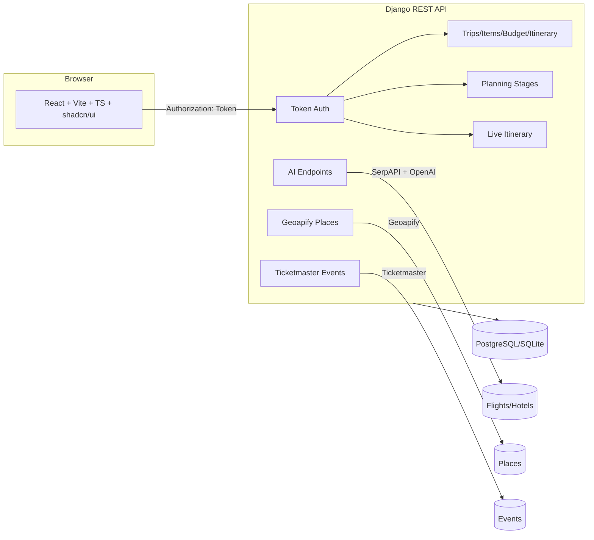

## Travel Planner (AI-powered)

An AI-assisted travel planning application with a Django REST API backend and a React (Vite + TypeScript + shadcn/ui) frontend. It supports user authentication, trip creation and management, AI-powered flight and hotel search via SerpAPI and OpenAI, trip budgeting, and live itinerary tracking.

### Highlights
- **Backend**: Django 5, Django REST Framework, Token auth, PostgreSQL
- **AI/Agents**: LangChain + OpenAI + SerpAPI (Google Flights/Hotels)
- **Frontend**: React 18, Vite, TypeScript, shadcn/ui, React Router
- **Features**: Auth, Trip planning workflow, Flight/Hotel AI search, Budgeting, Itinerary (including live items)

---

## Repository structure

```
travel/
  travel_backend/         # Django REST API
    manage.py
    requirements.txt
    travel_backend/       # Django project settings and URLs
    travel/               # App: models, serializers, views, URLs, AI agents
  travel_frontend/        # Vite + React + TS app (shadcn/ui)
    src/
      services/           # API clients (auth, trips, flights, hotels)
      contexts/           # AuthContext
      components/         # UI and business components
      pages/              # Top-level route views
```

---

## Prerequisites
- Python 3.11+
- Node.js 18+ and npm (or bun)
- PostgreSQL 14+
- SerpAPI account/key for Google Flights/Hotels
- OpenAI API key

---

## Quick start

### 1) Backend (Django API)

1. Create a virtual environment and install dependencies:
   - Linux/macOS:
     ```bash
     cd travel_backend
     python3 -m venv .venv
     source .venv/bin/activate
     pip install -r requirements.txt
     ```
   - Windows (PowerShell):
     ```powershell
     cd travel_backend
     python -m venv .venv
     .venv\Scripts\Activate.ps1
     pip install -r requirements.txt
     ```

2. Configure environment variables. Create `travel_backend/.env` from the example:
   ```bash
   cp travel_backend/.env.example travel_backend/.env
   ```
   Then set values:
   - `OPENAI_API_KEY`
   - `SERPAPI_KEY`
   - `DJANGO_SECRET_KEY`
   - `DJANGO_DEBUG` ("True"/"False")
   - `DB_NAME`, `DB_USER`, `DB_PASSWORD`, `DB_HOST`, `DB_PORT`

   Important: Configure all secrets via environment variables (see Security notes below). Do not hardcode credentials or secret keys in `settings.py`.

3. Apply migrations and create a superuser:
   ```bash
   python manage.py migrate
   python manage.py createsuperuser
   ```

4. Run the development server (defaults to `http://127.0.0.1:8000`):
   ```bash
   python manage.py runserver
   ```

5. Admin is available at `http://127.0.0.1:8000/admin/`.

### 2) Frontend (Vite + React)

1. Install dependencies:
   ```bash
   cd ../travel_frontend
   npm install
   ```

2. Start dev server (defaults to port `8080`; host is `::` for IPv6):
   ```bash
   npm run dev
   ```

3. Open `http://localhost:8080`.

Notes:
- Frontend services default to `http://localhost:8000/api` but respect `VITE_API_BASE_URL` if set.
- CORS is pre-configured in the backend for dev ports `5173`, `3000`, and `8080`.

---

## Deep Dive Guide

This section explains the project in depth: architecture, data model, request flows, key components, external integrations, and how the end-to-end planning experience is built.

### Table of contents
- Architecture overview
- Backend internals (Django + DRF)
- AI and external data integrations
- Frontend internals (React + Vite + shadcn/ui)
- End-to-end user flows (Auth, Planning, Results, Save)
- Planning stages lifecycle and persistence
- Caching and client-side data
- Configuration and environment variables
- Deployment notes (prod hardening)
- Troubleshooting cheatsheet

### Architecture overview



- Frontend handles UX, auth token storage, and calls the API via `src/services/*`.
- Backend authenticates every non-auth request with DRF TokenAuth, persists trips and selections, and orchestrates AI/data services.
- External services:
  - Flights: SerpAPI Google Flights via `FlightAIAgent` (with optional OpenAI reasoning) in `travel_backend/travel/flight_agent.py`.
  - Hotels: SerpAPI Google Hotels via `HotelAIAgent` in `travel_backend/travel/hotel_agent.py`.
  - Places: Geoapify Places for attractions/food/transport in `views.py`.
  - Events: Ticketmaster Discovery API.

---

## Backend architecture

### Installed apps and middleware
- Apps: `travel` (domain models and API), `rest_framework`, `rest_framework.authtoken`, `corsheaders`, plus Django contrib apps.
- Middleware includes `CorsMiddleware`.

### Data model overview
- `UserProfile`: One-to-one with `auth.User` (phone, DOB, picture, preferences)
- `Trip`: Core trip entity; fields for title, destination, dates, budget, style, status
- `TripItem`: Child items (flight, hotel, attraction, restaurant, transport, activity, event)
- `TripBudget`: One-to-one with trip with totals, spent, currency, breakdown
- `TripItinerary`: One-to-one with trip; `day_plans` JSON and notes
- `UserPreference`: User-level preferences (destinations, activities, dietary, accessibility)
- `TripPlanningStage`: Tracks planning stages (flight, hotel, attractions, food, transport) with `status`, `selected_items`, `ai_options`
- `LiveItineraryItem`: Per-day actionable items with planned/actual times and completion state

### Authentication
- Token Authentication via `rest_framework.authtoken`
- Endpoints return a token on signup/login; include `Authorization: Token <token>` on subsequent requests

### AI Agents
- `travel/flight_agent.py`: LangChain agent using OpenAI + SerpAPI Google Flights
- `travel/hotel_agent.py`: LangChain agent using OpenAI + SerpAPI Google Hotels
- Both load environment variables via `python-dotenv` (`.env`)

### API surface (prefix: `/api/`)

- Auth
  - `POST /auth/register/`: create user, returns token
  - `POST /auth/login/`: login, returns token
  - `POST /auth/logout/`: revoke token

- User
  - `GET|PUT /user/profile/`: get/update profile
  - `GET|PUT /user/preferences/`: get/update preferences
  - `GET /user/dashboard/`: aggregated counts, totals, recent trips

- Trips
  - `GET|POST /trips/`: list my trips / create
  - `GET|PUT|PATCH|DELETE /trips/{trip_id}/`: detail/update/delete
  - `GET /trips/{trip_id}/summary/`: selected items, totals, remaining budget

- Trip items
  - `GET|POST /trips/{trip_id}/items/`
  - `GET|PUT|PATCH|DELETE /trips/{trip_id}/items/{item_id}/`
  - `POST /trips/{trip_id}/items/{item_id}/select/`: toggle selection

- Budget & itinerary
  - `GET|PUT /trips/{trip_id}/budget/`
  - `GET|PUT /trips/{trip_id}/itinerary/`

- Planning stages
  - `GET|POST /trips/{trip_id}/planning-stages/`
  - `GET|PUT|DELETE /trips/{trip_id}/planning-stages/{stage_id}/`
  - `GET|POST /trips/{trip_id}/planning-progress/`: fetch or update batch
  - `POST /trips/{trip_id}/planning-stages/{stage_type}/update/`
  - `POST /trips/{trip_id}/planning-stages/{stage_type}/complete/`
  - `POST /trips/{trip_id}/planning-stages/{stage_type}/skip/`

- Live itinerary
  - `GET /trips/{trip_id}/live-itinerary/`: grouped per day
  - `GET|POST /trips/{trip_id}/live-itinerary/items/`
  - `GET|PUT|PATCH|DELETE /trips/{trip_id}/live-itinerary/items/{item_id}/`
  - `POST /trips/{trip_id}/live-itinerary/items/{item_id}/complete/`
  - `POST /trips/{trip_id}/live-itinerary/items/{item_id}/skip/`
  - `POST /trips/{trip_id}/live-itinerary/items/{item_id}/times/`

- AI search
  - `POST /flights/search/` body: `{ origin, destination, departure_date, return_date?, adults?, cabin_class?, preferences?, country? }`
  - `GET /flights/airports/?q=JFK` airport suggestions
  - `POST /hotels/search/` body: `{ destination, check_in_date, check_out_date, adults?, currency?, country?, language?, budget_max? }`

All non-auth endpoints require `Authorization: Token <token>`.

---

### Backend internals (Django + DRF)

- Models (`travel/models.py`):
  - `UserProfile`: user details and preferences.
  - `Trip`: title, destination, dates, budget, style, status.
  - `TripItem`: selected items across categories (flight, hotel, attraction, restaurant, transport, activity, event), metadata stored as JSON.
  - `TripBudget`: totals plus computed `remaining_budget` and `spent_percentage` properties.
  - `TripItinerary`: `day_plans` JSON for generated plans.
  - `TripPlanningStage`: stage_type (flight, hotel, attractions, food, transport), `selected_items`, `status`, `ai_options`, `stage_preferences`.
  - `LiveItineraryItem`: granular per-day actionable items with times and completion state.

- Authentication:
  - Token Authentication (`rest_framework.authtoken`).
  - Endpoints: `POST /api/auth/register/`, `POST /api/auth/login/`, `POST /api/auth/logout/`.
  - Most other endpoints require `Authorization: Token <token>`.

- Core endpoints (`travel/urls.py` → `travel/views.py`):
  - Trips: `GET|POST /api/trips/`, `GET|PUT|PATCH|DELETE /api/trips/{id}/`.
  - Items: `GET|POST /api/trips/{trip_id}/items/`, item detail, and `POST /api/trips/{trip_id}/items/{item_id}/select/`.
  - Budget: `GET|PUT /api/trips/{trip_id}/budget/`.
  - Itinerary: `GET|PUT /api/trips/{trip_id}/itinerary/`, `POST /api/trips/{trip_id}/itinerary/generate/` and `POST /api/trips/{trip_id}/itinerary/auto/` (multi-agent orchestration).
  - Planning stages: list/detail + progress batch update, per-stage update/complete/skip endpoints.
  - Live itinerary: group by day, CRUD for items, complete/skip, update times.

- Itinerary generation highlights:
  - `generate_full_itinerary`: orchestrates AI for flights/hotels (SerpAPI/OpenAI), discovers places (Geoapify), optionally events (Ticketmaster), persists `TripItem`s and `TripPlanningStage`s, then builds `TripItinerary.day_plans` with an OpenAI prompt (falls back to deterministic layout if LLM disabled/unavailable).
  - `generate_itinerary`: builds schedules from existing selections (TripItems/Stages) without external calls.

### AI and external data integrations

- Flights (`flight_agent.py`):
  - Uses SerpAPI Google Flights via `FlightSearchTool`. Tries localized `gl` candidates; processes results; provides recommendations.
  - Async facade `search_and_recommend_flights` returns `flights[]`, `recommendations`, `summary`.

- Hotels (`hotel_agent.py`):
  - Uses SerpAPI Google Hotels via `HotelSearchTool`. Extracts normalized fields (id, name, price, rating, location, distance, amenities, image, priceCategory).
  - Async facade `search_and_recommend_hotels` returns trimmed hotel items for the frontend.

- Places (`views.py`):
  - `POST /api/places/attractions/`: Geoapify with robust geocoding and category selection.
  - `POST /api/places/food/`: Geoapify `catering.*` categories.
  - `POST /api/places/transport/`: multiple fallbacks (place filters, circle radius) to maximize results.
  - `POST /api/places/guide/`: OpenAI-only concise JSON “place guide” (overview, best times, highlights, practical info, nearby).

- Events (`views.py`):
  - `GET /api/events/search/`: Ticketmaster Discovery API (optional; key required).

---

## Frontend architecture

- `src/contexts/AuthContext.tsx`: handles token lifecycle, profile load, and provides auth state
- `src/services/`: API clients
  - `authService.ts`: login/signup/logout, user profile
  - `tripService.ts`: trips, items, planning stages, summaries
  - `flightService.ts`: flights AI search and airport suggestions
  - `hotelService.ts`: hotels AI search
- `src/components/`: UI and feature components including trip planning flow and results
- `src/pages/Index.tsx`: entry view; switches between onboarding, planning, results, login, signup, and profile

Build/preview:
```bash
npm run build
npm run preview
```

---


### Frontend internals (React + Vite + shadcn/ui)

- Auth and state:
  - `AuthContext.tsx` keeps `user`, `isAuthenticated`, and error/loading state.
  - Token persisted in `localStorage` under `authToken` via `authService.ts`.
  - Signup does NOT auto-login (token returned by backend is ignored on signup); login stores token and loads profile.

- Services (`src/services/*`):
  - `authService.ts`: login/signup/logout/profile.
  - `tripService.ts`: trips, items, planning stages, itinerary orchestration.
  - `flightService.ts`, `hotelService.ts`, `placesService.ts`: AI/places endpoints.

- Major components:
  - `OnboardingScreen`: entry capture.
  - `TripPlanning`: creates a trip, seeds planning stages, and stores planning context in `localStorage`.
  - `TripResults`: orchestrates 6 tabs (Itinerary, Flights, Hotels, Places, Food, Transport) and maintains selections; syncs with planning stages.
  - Stage components: `FlightResults`, `HotelResults`, `AttractionsResults` (places), `FoodResults`, `TransportResults`.
    - Note: stage components no longer contain mock/seed lists; results are fetched via the Generate button or rehydrated from cache/stages.
  - `RealTimeItinerary`: shows the generated day-by-day plan; triggers a fresh generation if none exist for the current trip (limited fallback mock if no trip).
  - `BudgetTracker`, `WeatherInsights`, `EventsResults`, `FinalItinerary` (static showcase), `ProfilePage`.

- UX notifications
  - Toasts (`components/ui/toaster.tsx` + `hooks/use-toast.ts`): used for login/signup success/failure and can be reused for other flows.

---

## Configuration and environment

### Backend `.env` (example)
See `travel_backend/.env.example`.

### Frontend `.env` (optional)
See `travel_frontend/.env.example`. By default, services use `http://localhost:8000/api`. For deployments, either set `VITE_API_BASE_URL` and refactor services to read it, or update the hardcoded constants.

### CORS/CSRF
`CORS_ALLOWED_ORIGINS` and `CSRF_TRUSTED_ORIGINS` pre-include common dev ports (5173, 3000, 8080). Add your production domain(s) when deploying.

---

## Security notes (critical before pushing public)
- Move all secrets from `settings.py` to environment variables (`DJANGO_SECRET_KEY`, database credentials). Consider using `python-decouple` or `os.getenv` + `python-dotenv`.
- Rotate any previously committed keys/passwords (database, OpenAI, SerpAPI, Django secret key).
- Do not commit `.env` files; they are ignored by `.gitignore`.
- In `flight_agent.py`, avoid defaulting `SERPAPI_KEY` in code; read from env only.


### End-to-end user flows

- Authentication
  1) Signup → success toast → redirect to Login.
  2) Login → success toast → redirect to Home (`/`).
  3) Wrong credentials → error toast with backend message.

- Planning
  1) Onboarding or “AI Planner” opens `TripPlanning`.
  2) Submit creates a `Trip` and initializes 5 `TripPlanningStage`s (pending) then emits an event to open results.
  3) In `TripResults`, each stage tab has a Generate CTA to fetch items (AI/Geoapify). Selections are saved into planning stages.
  4) Save Complete Trip persists all selected items as `TripItem`s and syncs stages.

- Itinerary
  - `RealTimeItinerary` loads existing `TripItinerary`; if missing, calls `POST /itinerary/auto/` to create it. Live mode can adjust times visually on completion.

### Planning stages lifecycle and persistence

- The backend `TripPlanningStage` stores:
  - `stage_type`: one of `flight|hotel|attractions|food|transport`.
  - `status`: `pending|in_progress|completed|skipped`.
  - `selected_items`: the full objects selected in the UI (lightweight JSON, not strict schema).
  - `ai_options`, `stage_preferences`, `notes`: optional metadata.

- Frontend behavior:
  - When a user selects items, the stage is updated via `POST /planning-stages/{stage_type}/update/` with `selected_items` and a computed `status`.
  - If a `tripId` is not yet present (edge flow), selections are stored locally under `pendingSelections` and pushed once a trip is saved.
  - The UI rehydrates stage selections on mount and on `window` events (`itinerary:refresh`).

### Caching and client-side data

- `localStorage` keys used by the frontend:
  - `authToken`: DRF token after login.
  - `tripPlanningData`: last planning form submission with `cityHint` and `countryHint` (used by searches).
  - `currentTripId`: working trip id during planning.
  - `hotels_cache_results`, `places_cache_attractions`, `places_cache_food`, `places_cache_transport`: last-generated lists for quick rehydrate on tab switches.
  - `pendingSelections`: ephemeral stage selections when no trip id yet.

### Configuration and environment variables

- Backend (`travel_backend/.env`):
  - `DJANGO_SECRET_KEY`, `DJANGO_DEBUG`, `ALLOWED_HOSTS`
  - `DB_NAME`, `DB_USER`, `DB_PASSWORD`, `DB_HOST`, `DB_PORT`
  - `OPENAI_API_KEY`, `OPENAI_MODEL` (defaults to `gpt-4o-mini`)
  - `SERPAPI_KEY`
  - `GEOAPIFY_API_KEY`
  - `TICKETMASTER_API_KEY` (optional)

- Frontend (`travel_frontend/.env`):
  - `VITE_API_BASE_URL` (defaults to `http://localhost:8000/api` when unset)

### Deployment notes (prod hardening)

- Move all secrets to environment variables (already supported in settings).
- Configure CORS and CSRF origins for your deployed domains.
- Ensure DB is Postgres in production; run migrations before rollout.
- If OpenAI/SerpAPI keys are missing, AI search will be disabled/fallbacks used; design your UX accordingly.

### Troubleshooting cheatsheet

- 401/403 on API calls
  - Ensure token is present in `localStorage` and sent as `Authorization: Token <token>`.
  - Verify CORS/CSRF configuration and `ALLOWED_HOSTS`.

- “No results found” for places/hotels
  - Check `GEOAPIFY_API_KEY` or `SERPAPI_KEY` and network egress policies.
  - Stage components require clicking Generate; mock seed lists were removed.

- Itinerary not generating
  - Confirm `currentTripId` exists; check logs for `generate_full_itinerary` errors; ensure OpenAI key is present for AI itinerary.

- Flight/Hotel AI errors
  - Confirm both `OPENAI_API_KEY` and `SERPAPI_KEY` are configured. The agents will log attempts and fallbacks.

---

## License
Proprietary (update as needed).


---